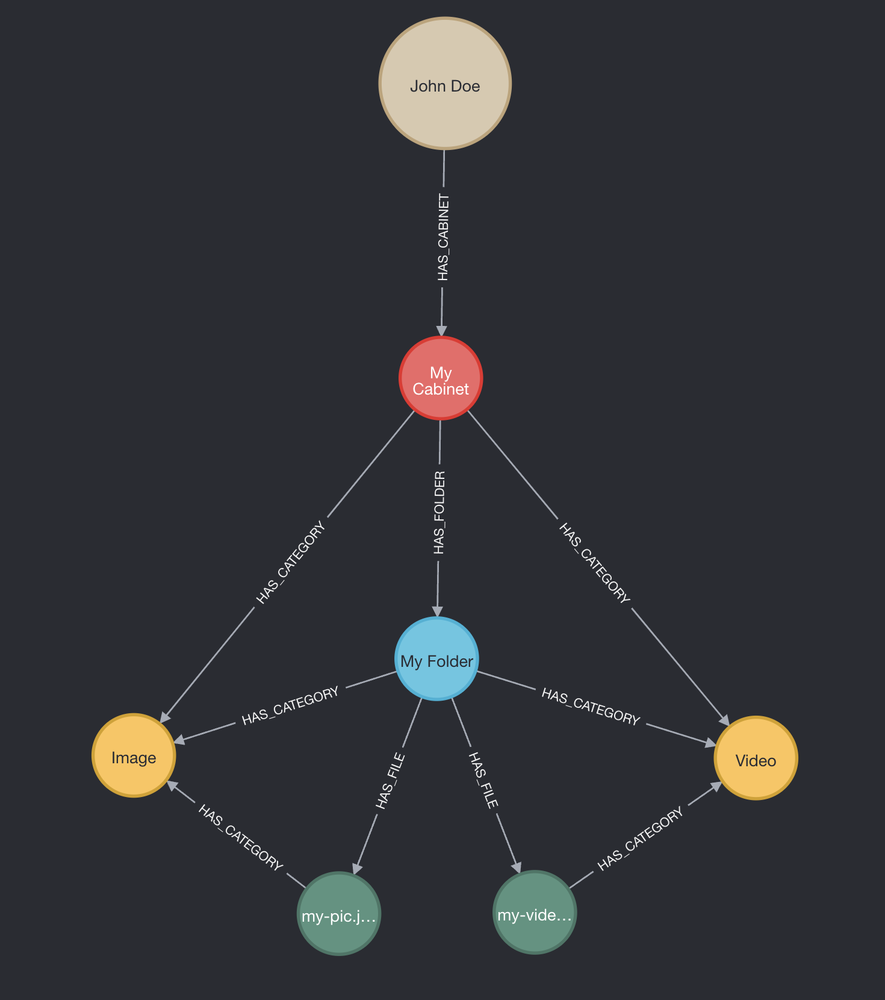

# neo4j-graphql-where-bug

# How to run dev mode

1. Create a `.env` file with the following contents
    ```
    ENVIRONMENT=local
    NEO4J_URL=****
    NEO4J_USER=****
    NEO4J_PASS=****
    ```
    All variables can be found under this project's Settings -> Secrets and variables -> Actions -> "Variables" tab
2. Be on Node 20
3. Run `npm install`
4. Run `npm run dev`

    a. (optional) Run `npm run dev:debug` to get Cypher output

# Reproducing the error

1. Go to `localhost:4000/graphql`
2. Run the following mutation:
    ```gql
    mutation DeleteCategory($categoryId: ID!) {
      deleteCategories(where: { id: $categoryId }) {
        __typename
        nodesDeleted
        relationshipsDeleted
      }
    }

    // Variables
    {
      "categoryId": "category-video"
    }
    ```
3. The response should return an error `"Variable this not defined (line 9, column 8 (offset: 281))\n\"WHERE (this.id = $param1 AND ($isAuthenticated = true AND var2 = true))\"\..."`

The corresponding Cypher output:
```cypher
MATCH (this:Category)
MATCH (this)<-[:HAS_CATEGORY]-(this0:Cabinet)
OPTIONAL MATCH (this0)<-[:HAS_CABINET]-(this1:User)
WITH *, count(this1) AS userCount
WITH *
WHERE (userCount <> 0 AND ($jwt.sub IS NOT NULL AND this1.id = $jwt.sub))
RETURN count(this0) = 1 AS var2
WITH *
WHERE (this.id = $param1 AND ($isAuthenticated = true AND var2 = true))
DETACH DELETE this

cypher params: {
  jwt: {
    iat: 1724442925,
    exp: 9724445955,
    sub: '4252a2b0-9492-4bef-8a94-fa20c97e7f71',
    tId: 'public',
    sessionHandle: 'a9021a8e-0d39-4639-8cb4-276e1724ba69',
    'st-ev': { v: true, t: 1724442925149 },
    'st-role': { v: [Array], t: 1724172602771 },
    'st-perm': { v: [], t: 1724172602871 }
  },
  param1: 'category-video',
  isAuthenticated: true
}
```

This is what the schema looks like visually:

